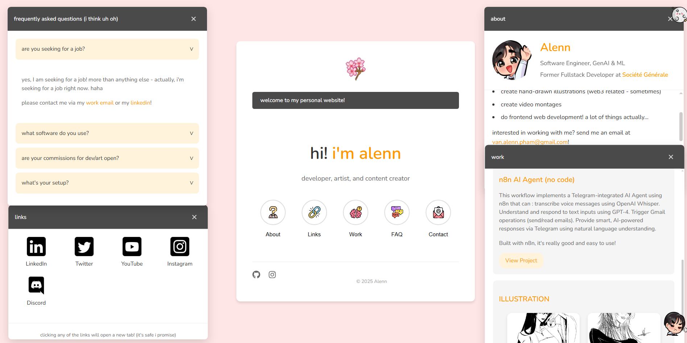
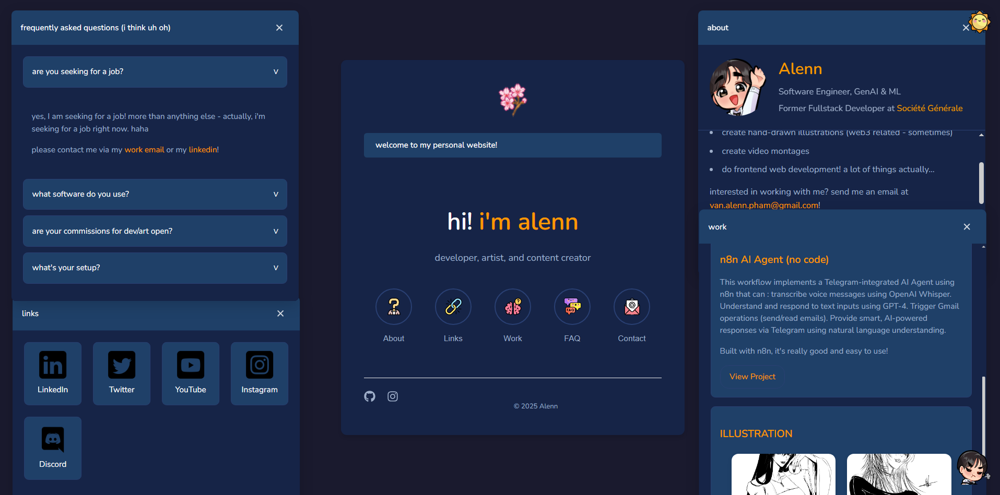

# [ALYAP](https://incalenn.github.io/alyap/): My AI-Designed Portfolio App

## Introduction

As someone passionate about both technology and creativity, I wanted my personal website to reflect not just who I am—but also **how I work**. I built this portfolio using **React**, with the assistance of **Cursor**, an AI-augmented IDE that became a true creative partner throughout the process which roughly took 1h30-2h.

This wasn’t just about building a site. It was about **exploring how AI and prompt engineering** can accelerate design, coding, and UX thinking. What you see here is the result of hours of collaboration—me and an AI assistant, side by side.

---

## Project Overview

This is a responsive, interactive, and animated portfolio site that showcases my profile, work, and contact details. But beyond the visuals, it's a reflection of **my exploration of AI tools in real-world frontend development**.

**Key features include:**

- Dark/light mode toggle  
- Animated illustrations and icons  
- Background music with mute control  
- Sectioned layout: About Me, Projects, Contact, Social links  
- Prompt-engineered component design and refactoring with Cursor

---

##  Why I Used Cursor

I used [Cursor](https://www.cursor.sh/) not just to autocomplete code—but to **generate ideas**, **debug faster**, and **build smarter**. Through prompt engineering, I asked Cursor questions like:

- _"Build a hero section with an image on the left and text on the right."_  
- _"Suggest a way to animate a modal popup when clicking a contact icon."_  
- _"Why is this state update causing a re-render loop in React?"_

Each time, Cursor helped me either generate code, brainstorm variations, or spot bugs quickly. It felt like I had a pair programmer who never got tired.

---

## Tech Stack

| Technology     | Role                                      |
|----------------|-------------------------------------------|
| React          | Frontend framework                        |
| JavaScript     | Application logic                         |
| CSS            | Custom styling                            |
| Cursor         | AI-powered development & debugging        |
| Public Assets  | Illustrations, icons, profile, and music  |

---

## What AI Helped Me Do

- **Rapid Prototyping** – I used prompts to sketch out sections and components faster than ever.  
- **UI/UX Ideation** – Cursor suggested design tweaks and animation strategies I hadn’t thought of.  
- **Clean Code** – Prompt-based refactoring helped me simplify functions and improve readability.  
- **Creative Flow** – With AI handling the boilerplate, I focused more on what the experience should feel like.

---

## Features

- Dark/Light mode toggle  
- Background music with toggle  
- Personal intro and profile image  
- Modular project cards  
- Contact & social links  
- Fully responsive design

---

## What I Learned
- Prompt engineering is an art. The better I communicated with Cursor, the better its output became.
- AI doesn’t replace creativity—it augments it.
- Debugging with AI saved me hours, especially when isolating state and UI bugs.
- Designing UI with AI is like having a brainstorming partner who speaks code.

---

## What’s Next
- Make a professional website from scratch
- Add multilingual support
- Connect to Notion or Google Sheets for dynamic content
- Schedule updates or daily refresh animations
